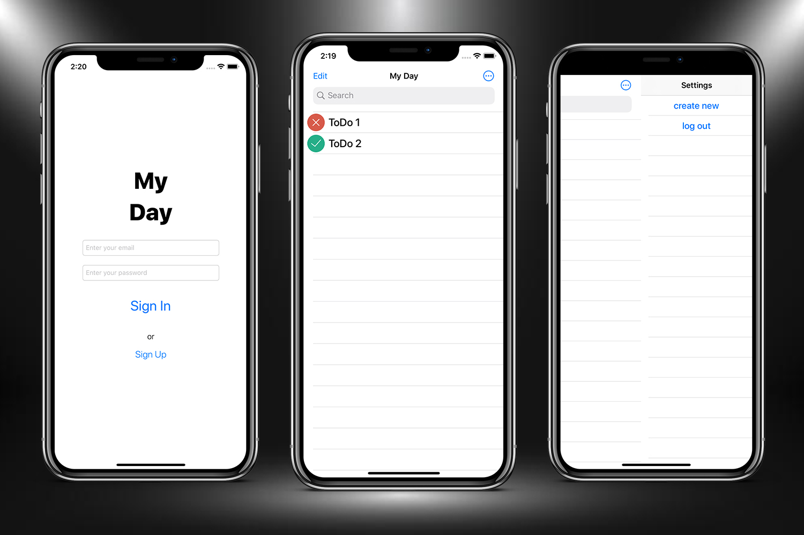

# My-Day

This is a To Do app. It makes it very convenient to create new To Do's. The application implements registration using the Firebase. And it also has a Side Menu.

## Screenshots

## License

My-Day is available under the MIT license. See the LICENSE file for more info.
